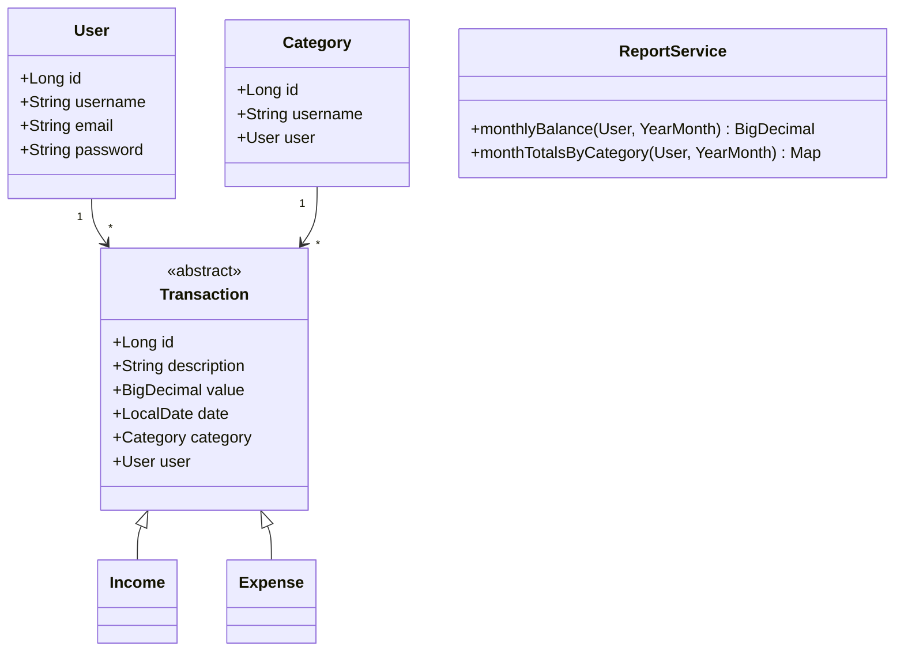

```mermaid
classDiagram
    class User {
        +Long id
        +String username
        +String email
        +String password
    }
    class Category {
        +Long id
        +String username
        +User user
    }
    class Transaction {
        <<abstract>>
        +Long id
        +String description
        +BigDecimal value
        +LocalDate date
        +Category category
        +User user
    }
    class Income
    class Expense
    class ReportService {
        +monthlyBalance(User, YearMonth) BigDecimal
        +monthTotalsByCategory(User, YearMonth) Map
    }

    User "1" --> "*" Transaction
    Category "1" --> "*" Transaction
    Transaction <|-- Income
    Transaction <|-- Expense
```
